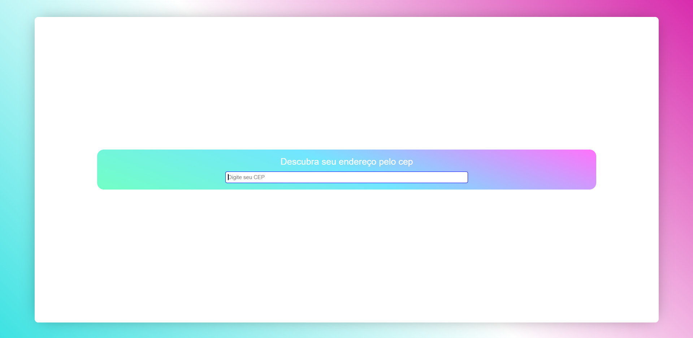
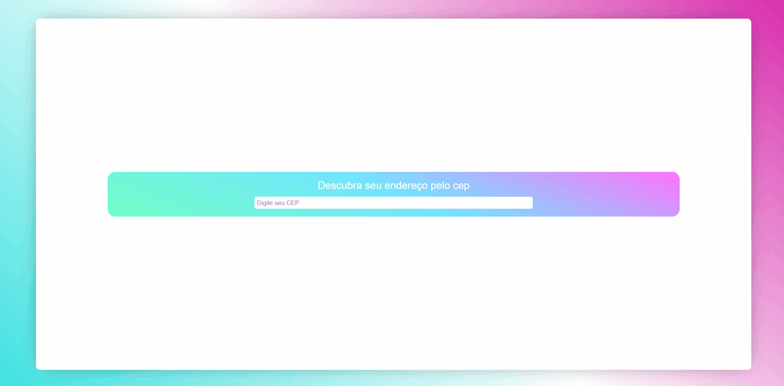

## CEPLYZER.io
  

This is a personal project of React JS with Typescript, where I use a zip code to find the address

You can access the link: https://calebe-xavier-developer.github.io/ceplyzer.io/
